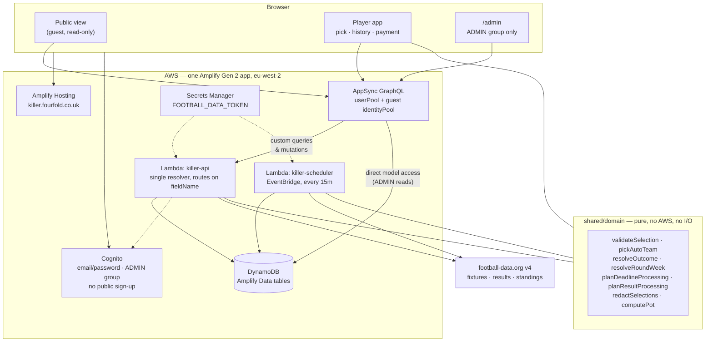

# Fourfold Killer

Premier League Last Man Standing, for a small private group.

Pick one team each gameweek. If they win, you survive. Draw or lose and you are out. You cannot
use the same team twice in a Killer Round. Last player standing takes the pot; if everybody goes
out together, the pot rolls over into the next round.

Live at **https://killer.fourfold.co.uk**

---

## Contents

- [Architecture](#architecture)
- [Domain concepts](#domain-concepts)
- [How the rules are enforced](#how-the-rules-are-enforced)
- [Local development](#local-development)
- [Amplify sandbox](#amplify-sandbox)
- [Deployment](#deployment)
- [Environment and secrets](#environment-and-secrets)
- [football-data.org setup](#football-dataorg-setup)
- [Administrator setup](#administrator-setup)
- [Running the competition](#running-the-competition)
- [Result processing](#result-processing)
- [Rollover processing](#rollover-processing)
- [Data migration](#data-migration)
- [Testing](#testing)
- [Troubleshooting](#troubleshooting)

---

## Architecture



Four backend resources: Cognito, AppSync/DynamoDB, and two Lambdas. No containers, no queues, no
relational database. Runtime dependencies are `react`, `react-dom`, `react-router-dom` and
`aws-amplify` — nothing else.

### Layout

```
shared/            Pure domain code. No AWS imports, no I/O. The rules live here.
  domain/          Selection rules, auto-picks, outcomes, planners, privacy, money, formatting
  provider/        FootballDataProvider interface + football-data.org implementation
  legacy/          Parser for the historical killer.csv
amplify/
  auth/            Cognito: email login, ADMIN group, Lambda access grants
  data/            Schema, secondary indexes, authorization, custom operations
  functions/
    killer-api/       AppSync resolver for every custom query and mutation
    killer-scheduler/ 15-minute heartbeat
  shared/          Backend-only: repository, view builders, executors, sync, audit
src/               React app. Business rules are imported from shared/, never redefined
scripts/           One-time legacy CSV import
docs/              Implementation plan, migration report
```

### Two design decisions worth knowing

**Pure planners, thin executors.** Deadline and result processing are pure functions of state
(`planDeadlineProcessing`, `planResultProcessing`) that return a *plan* — a list of intended
writes. The Lambda then performs exactly those writes and nothing else. This makes idempotency a
property you can assert in a unit test: apply the plan, re-plan against the resulting state, and
the second plan must be empty. The scheduled path and the admin "do it now" button run the same
planner, so they cannot drift apart.

**One Lambda per concern, not per operation.** `killer-api` serves every custom query and mutation,
routing on `event.info.fieldName`. AppSync applies the per-field authorization rules before
invoking it, so a player cannot reach an `adminXxx` field at all, and the router re-checks
`cognito:groups` inside each admin branch as a second line. The alternative — a dozen Lambdas — is
a dozen log groups and a dozen cold starts for an application a handful of people open once a week.

---

## Domain concepts

| Term | Meaning |
| --- | --- |
| **Season** | An EPL season, e.g. `2026/27`. Holds the 20 teams and every fixture. |
| **Killer Round** | One complete contest. Runs until one player is left, or everybody goes out together. |
| **Round Week** | One gameweek of a Killer Round, linked to an EPL matchday, with a selection deadline. |
| **Round Entry** | A player's participation in a Killer Round: alive/eliminated/winner, paid or not. |
| **Selection** | A pick. Manual, automatically assigned after a missed deadline, or set by an admin. |
| **Rollover** | Everybody remaining eliminated in the same week. No winner; the pot carries forward. |

Killer Round 3 might be: Round Week 1 = GW5, Round Week 2 = GW6, Round Week 3 = GW8. **Gameweeks
do not have to be consecutive** — the administrator chooses which ones make up the competition.

### Conventions

- **Money is integer pence.** `entryFeePence`, `rolloverInPence`. Default fee £5 = `500`. Pounds
  exist only in `formatPence()` at the presentation edge.
- **Time is UTC.** Stored as ISO-8601. `Europe/London` appears only in `Intl.DateTimeFormat`, in
  `shared/domain/format.ts`. There is no date library.
- **The expected pot counts every entrant.** Entering incurs the fee whether or not payment has
  been recorded. `expectedEntriesPence`, `collectedPence` and `outstandingPence` are reported
  separately and never conflated.
- **`RoundEntry.entryFeePence` snapshots the fee at entry**, so editing a round's fee later cannot
  rewrite what anybody owed.

---

## How the rules are enforced

Everything below is enforced server-side. The disabled buttons in the UI are a courtesy.

**Selection privacy.** `Selection` has *no* client authorization rule — not read, not write, for
players or guests. The only way to see a pick is `getCompetitionView`, whose Lambda applies
`redactSelections` before returning: before a deadline you see `Submitted 🔒` for other players,
after it you see everything, admins see everything immediately, and you always see your own. There
is no query a curious player can issue to get round it.

**Selection submission.** `submitSelection` checks the caller's identity from the AppSync token
(never from an argument), that their entry is `ALIVE`, that the week is `OPEN`, that
`now < deadline`, that they have not already used the team in this Killer Round, and that the team
belongs to the season. A pick exactly on the deadline is rejected — the deadline is the first
kick-off.

**Payment.** `markSelfPaid` finds the entry from the viewer's player id, so there is no id to
tamper with. Players cannot unmark themselves; that is an audited admin action. `RoundEntry` grants
players read and nothing else, so nobody can flip another player's `paid` flag or resurrect their
own eliminated entry.

**Idempotency.** `Selection.id` is `{roundWeekId}#{roundEntryId}`. Amplify's create resolver puts
with `attribute_not_exists(id)`, so one-pick-per-player-per-week is a database constraint, and two
concurrent deadline runs cannot produce two picks — the loser of the race treats the conditional
failure as success.

**Automatic picks.** Assigned from the standings **snapshot captured at the deadline**, walking up
from 20th place, skipping teams the player has used and teams without a fixture. The snapshot id,
the resulting team and a human-readable explanation are all persisted, so the decision is
explainable later and is never recomputed against a table that has moved on.

**Unusual fixtures.** Only `FINISHED` and `AWARDED` produce a result. `POSTPONED`, `SUSPENDED`,
`CANCELLED` and anything unrecognised leave the selection `PENDING`. Nobody is eliminated because
the weather intervened or because the provider invented a status. Cancelled fixtures are flagged
for an administrator in the audit log.

**Admin overrides** set `overridden: true`, after which result processing leaves the record alone
permanently — otherwise the next sync would quietly undo the decision. Every override is audited
with before and after state.

**Secrets.** The football-data.org token is in Secrets Manager, read only inside Lambda. Nothing in
`src/` imports the provider.

---

## Local development

```bash
npm install
npm test          # 238 tests, all business logic. No AWS needed.
npm run typecheck
```

To run the app you need a backend. Either start a personal sandbox (below) or copy the placeholder
outputs to compile without one:

```bash
cp amplify_outputs.example.json amplify_outputs.json
npm run dev       # compiles and serves, but every API call will fail
```

---

## Amplify sandbox

A sandbox is your own isolated copy of the whole backend.

```bash
npx ampx sandbox secret set FOOTBALL_DATA_TOKEN   # paste your token
npx ampx sandbox                                  # deploys, then watches for changes
```

This writes `amplify_outputs.json` (gitignored) and generates the `$amplify/env/*` types the Lambda
handlers import. Until it has run at least once, `npm run typecheck:backend` reports two
unresolved-module errors for those generated files — that is expected, and the frontend
`npm run typecheck` excludes the handlers for exactly this reason.

In a second terminal:

```bash
npm run dev
```

Tear down with `npx ampx sandbox delete`.

---

## Deployment

Deploys are triggered by pushing to `main`. The existing Amplify app, branch and custom domain are
reused:

| Setting | Value |
| --- | --- |
| Amplify app | `epl-killer-react-aws` (`d3kbnyd2qvlcqc`) |
| Region | `eu-west-2` |
| Branch | `main` |
| Domain | `killer.fourfold.co.uk` |
| SPA rewrite | 200 rewrite to `/index.html`, excluding asset extensions (see below) |

### One-time setup

The previous build spec was frontend-only, so the backend has never been deployed. Two things are
needed once:

**1. Commit `amplify.yml`.** It adds the backend phase:

```yaml
backend:
  phases:
    build:
      commands:
        - npm ci --cache .npm --prefer-offline
        - npx ampx pipeline-deploy --branch $AWS_BRANCH --app-id $AWS_APP_ID
```

If the Amplify console has an inline build spec saved, it overrides the repository file — clear it
under *App settings → Build settings* so `amplify.yml` is used.

**2. Give the app a service role with backend-deploy permission.**

The app starts with no service role at all, which is fine for a static site but not for a Gen 2
backend — without one the backend phase fails with an access-denied error from CloudFormation.

The managed policy to use is **`AdministratorAccess-Amplify`**. It is broad, but Gen 2 deploys
create Cognito user pools, AppSync APIs, DynamoDB tables, Lambdas and their execution roles, so a
narrower policy does not work; scoping the role's *trust* to this one app is what keeps it
contained.

Create the role and attach it:

```bash
APP_ID=d3kbnyd2qvlcqc
ACCOUNT=$(aws sts get-caller-identity --query Account --output text)

cat > /tmp/trust.json <<JSON
{
  "Version": "2012-10-17",
  "Statement": [{
    "Effect": "Allow",
    "Principal": { "Service": "amplify.amazonaws.com" },
    "Action": "sts:AssumeRole",
    "Condition": {
      "StringEquals": { "aws:SourceAccount": "${ACCOUNT}" },
      "ArnLike": { "aws:SourceArn": "arn:aws:amplify:eu-west-2:${ACCOUNT}:apps/${APP_ID}*" }
    }
  }]
}
JSON

aws iam create-role \
  --role-name AmplifyKillerBackendDeploy \
  --assume-role-policy-document file:///tmp/trust.json

aws iam attach-role-policy \
  --role-name AmplifyKillerBackendDeploy \
  --policy-arn arn:aws:iam::aws:policy/AdministratorAccess-Amplify

aws amplify update-app \
  --app-id "$APP_ID" \
  --iam-service-role-arn "arn:aws:iam::${ACCOUNT}:role/AmplifyKillerBackendDeploy" \
  --region eu-west-2
```

In the console the equivalent is *App settings → IAM roles → Service role → Create and use a new
service role*, which builds the same thing. Note that the console lists existing **roles**, not
policies — if you go looking for a policy name there you will not find one.

#### The SPA rewrite rule

Client-side routing needs Amplify to serve `index.html` for any path that is not a real file.
**This is app-level hosting config, not part of the Gen 2 backend**, so it lives in the Amplify
console rather than in this repository — which means it would be lost if the app were ever
recreated. Recorded here for that reason:

```json
[
  {
    "source": "</^[^.]+$|\\.(?!(css|gif|ico|jpg|js|png|txt|svg|woff|woff2|ttf|map|json|webp)$)([^.]+$)/>",
    "target": "/index.html",
    "status": "200"
  }
]
```

```bash
aws amplify update-app --app-id d3kbnyd2qvlcqc --region eu-west-2 \
  --custom-rules file://spa-rules.json
```

The regex matters: it excludes asset extensions, so `/assets/index-abc.js` is served as JavaScript
rather than being rewritten to HTML. Get that wrong and the bundle 404s and the whole site breaks,
so verify both after any change:

```bash
curl -s -o /dev/null -w '%{http_code} %{content_type}\n' https://killer.fourfold.co.uk/rules
curl -s -o /dev/null -w '%{http_code} %{content_type}\n' https://killer.fourfold.co.uk/assets/<bundle>.js
```

Want `200 text/html` for the first and `200 text/javascript` for the second.

The app previously used `{"source": "/<*>", "target": "/index.html", "status": "404-200"}`, which
served the right page but returned **HTTP 404** for every deep route. That was harmless when the
site had no routing, but it stops WhatsApp and iMessage generating link previews — which matters
when that is how the competition gets shared.

#### If you reuse a role from another Amplify app

This account shares `AMPLIFY_ASSUME` across apps. Setting it as the service role is not enough on
its own: the role's **trust policy** scopes `aws:SourceArn` to specific app ids, so Amplify cannot
assume it on behalf of an app that is not listed. The build then fails in the backend phase with an
assume-role denial that does not name the real cause.

`aws:SourceArn` accepts an array, so each app that uses the role needs an entry:

```
"ArnLike": {
  "aws:SourceArn": [
    "arn:aws:amplify:eu-west-2:343893643132:apps/dl1ttg477pxdt*",
    "arn:aws:amplify:eu-west-2:343893643132:apps/d3kbnyd2qvlcqc*"
  ]
}
```

```bash
aws iam update-assume-role-policy \
  --role-name AMPLIFY_ASSUME \
  --policy-document file://trust.json

# Confirm both apps are listed
aws iam get-role --role-name AMPLIFY_ASSUME \
  --query 'Role.AssumeRolePolicyDocument.Statement[0].Condition.ArnLike'
```

Console: *IAM → Roles → AMPLIFY_ASSUME → Trust relationships → Edit trust policy*.

The trade-off of sharing: both apps deploy under one identity, so the `SourceArn` condition no
longer isolates them from each other. A dedicated role per app is tidier if you would rather keep
that separation.

### Then

```bash
git push origin main
```

The build runs `ampx pipeline-deploy` (backend), then `npm test` and `npm run build` (frontend). A
failing test stops the deployment, which is deliberate: this application handles money.

---

## Environment and secrets

One secret, and it must never reach the browser.

| Name | Where | How |
| --- | --- | --- |
| `FOOTBALL_DATA_TOKEN` | sandbox | `npx ampx sandbox secret set FOOTBALL_DATA_TOKEN` |
| `FOOTBALL_DATA_TOKEN` | `main` | Amplify console → *Hosting → Secrets → Manage secrets* |

It is referenced as `secret('FOOTBALL_DATA_TOKEN')` in both function resources, fetched at runtime
and held in memory only. It is never rendered into build artefacts.

The old `VITE_CSV_URL` environment variable can be deleted from the Amplify app once the migration
has run. The CSV's S3 bucket and CloudFront distribution (`E2HS1JC1TWFE6R`) become read-only
history and can be retired.

---

## football-data.org setup

Register at https://www.football-data.org/client/register for a free API token.

Free tier, verified against the current documentation:

- **10 requests per minute.** Exceeding it returns HTTP 429 with a `Retry-After` header.
- Covers the top competitions including the Premier League (`PL`).
- Endpoints used: `/competitions/PL`, `/competitions/PL/teams`, `/competitions/PL/matches`,
  `/competitions/PL/standings`.
- Live minute-by-minute scores are not needed and not requested. The free tier delivers results
  with a delay, which does not matter here: the scheduler does not ask for results until kick-off
  plus two hours, and re-checks every 15 minutes until they resolve.
- **Free forever, no payment method.** Sign up with an email address; the token appears in your
  account area.

### Attribution is required

The free tier's terms require a visible credit — "Football data provided by the Football-Data.org
API" — in a footer, about section or similar. This is implemented as `SiteFooter` in `src/App.tsx`
and appears on every page. **It is a licence condition, not decoration.** If you remove it, or
switch to a provider with different terms, update it accordingly rather than deleting it.

The client in `shared/provider/footballDataOrg.ts` paces its own requests to stay inside the
allowance, retries a 429 for as long as the server asks, and retries 5xx with backoff. Failures are
recorded as `FootballDataSync` rows and never propagate to a read path — **a provider outage means
results look stale, not that the site is down.**

### Switching provider

Implement `FootballDataProvider` (`getCompetition`, `getTeams`, `getFixtures`,
`getFixturesForMatchday`, `getStandings`, `getResults`) and map the responses into the types in
`shared/provider/FootballDataProvider.ts`. Nothing outside `shared/provider/` references a
provider's own field names, so no domain code, no Lambda and no component changes.

### Synchronisation schedule

`killer-scheduler` runs every 15 minutes and decides what to do from the database rather than from
the clock:

1. Query `RoundWeek` by status and deadline. Nothing due → return. One DynamoDB query, no external
   calls. This is the common case.
2. A deadline passed → capture standings if the last snapshot is stale, then lock the week and
   assign automatic picks.
3. A locked week whose fixtures could have finished (kick-off + 2h) with unresolved picks → sync
   results for that matchday, then resolve.
4. Last successful fixtures or standings sync more than 20 hours ago → refresh. After a failure it
   backs off for an hour rather than retrying every tick.

96 invocations a day, most of them a single query. Well inside the Lambda free tier and the
provider's rate limit.

A deadline processed up to 15 minutes late costs nothing: `submitSelection` rejects picks on the
deadline itself, so lateness delays the reveal but never lets a pick through.

---

## Administrator setup

Public sign-up is closed (`allowAdminCreateUserOnly`), so the first administrator has to be created
by hand. Once.

```bash
# Get the user pool id from amplify_outputs.json
POOL=$(node -p "require('./amplify_outputs.json').auth.user_pool_id")

aws cognito-idp admin-create-user \
  --user-pool-id "$POOL" \
  --username you@example.com \
  --user-attributes Name=email,Value=you@example.com Name=email_verified,Value=true \
  --region eu-west-2

aws cognito-idp admin-add-user-to-group \
  --user-pool-id "$POOL" \
  --username you@example.com \
  --group-name ADMIN \
  --region eu-west-2
```

Cognito emails a temporary password. Sign in at `/login`, set a real password, and `/admin` appears
in the navigation. Then create your own `Player` record from *Admin → Players* so you can pick as
well as administer.

Administrators are a Cognito group, checked from the signed token. There is no email address
hard-coded anywhere in React.

### Invitation emails: Cognito default vs SES

Out of the box the user pool uses `EmailSendingAccount: COGNITO_DEFAULT`. That has two problems:

- **A hard cap of 50 emails per day.** Fine for eleven players, but it is a shared AWS sender.
- **Poor deliverability.** It sends from a generic no-reply address with no DKIM against your
  domain, so invitations land in spam fairly often. If a player says "I never got the email",
  this is the first thing to check — and the fix is not to resend it.

Switching Cognito to Amazon SES fixes both. Add a `senders` block to `defineAuth`:

```ts
export const auth = defineAuth({
  loginWith: { email: true },
  groups: ['ADMIN'],
  senders: {
    email: {
      fromEmail: 'killer@fourfold.co.uk',
      fromName: 'Fourfold Killer',
    },
  },
  access: (allow) => [/* ... */],
});
```

`fromEmail` must be an SES **verified identity** in the same region as the user pool
(`eu-west-2`). State of this account, checked with `aws sesv2 get-account` and
`list-email-identities`:

| Item | State |
| --- | --- |
| Production access | **enabled** — no sandbox request needed |
| Quota | 50,000/day, 14/sec |
| `fourfold.co.uk` | **not verified** — this is the one to add |
| Other identities | a personal address and an unrelated domain are already verified |

Check the current list yourself rather than trusting this table:

```bash
aws sesv2 list-email-identities --region eu-west-2 \
  --query 'EmailIdentities[].{Identity:IdentityName,Type:IdentityType}' --output table
```

So the tidy option is to verify the domain the site already runs on and send as
`killer@fourfold.co.uk`:

```bash
aws sesv2 create-email-identity --email-identity fourfold.co.uk --region eu-west-2
aws sesv2 get-email-identity --email-identity fourfold.co.uk --region eu-west-2 \
  --query 'DkimAttributes.Tokens'
```

Publish the three returned CNAME records as `<token>._domainkey.fourfold.co.uk`, wait for
`VerifiedForSendingStatus: true`, then deploy. Domain verification with DKIM is what actually keeps
invitations out of spam — a bare verified address does not sign anything.

For a quicker test, any address already listed as verified works as `fromEmail` today, without
waiting on DNS.

**Until SES is wired up**, the reliable way to get somebody signed in is to set their password
directly and skip email entirely:

```bash
aws cognito-idp admin-set-user-password --region eu-west-2 \
  --user-pool-id <pool-id> --username someone@example.com \
  --password '<at least 10 chars, with a number>' --permanent
```

`--permanent` also clears `FORCE_CHANGE_PASSWORD`, so they sign straight in. Note that this skips
the forced-password-change flow, which is worth exercising at least once against a real inbox
before you invite everybody.

---

## Running the competition

### Adding players

*Admin → Players → Add a player.* Display name, email, optionally administrator.

This calls `adminInvitePlayer`, which runs `AdminCreateUser` inside the Lambda and creates the
`Player` record. Cognito sends a temporary password; the player sets their own on first sign-in.
Untick "Send a Cognito invitation" to create a player record with no login — useful for somebody
who pays in cash and never signs in.

The `Player` record is separate from the Cognito user on purpose: it owns the history, so it
survives an email change or a rebuilt login. If a Player exists with a matching email but no
`cognitoUserId`, the backend links them automatically the first time that person signs in.

Deactivating a player never deletes anything.

### Starting a Killer Round

1. *Admin → Rounds.* Create a season if there is not one, then **sync teams and fixtures**
   (*Admin → Football data*) — a round cannot have Round Weeks without imported fixtures.
2. *Create a Killer Round.* Set the entry fee (defaults to £5). If the previous round rolled over,
   choose it under "Rolled over from" so the money trail is explicit.
3. *Start.* This enters every active player, snapshots the entry fee onto each entry, carries the
   rollover across, and sets the round `ACTIVE`.

### Managing entrants

`adminStartRound` enters every **active** player, once, at the moment the round starts. That covers
the usual case — the same group plays every round — but it has an obvious trap: **players added
after the round has started do not get entries.**

So *Admin → Rounds → Manage* lists every active player with an **Enter / Remove** toggle, plus an
*Enter all remaining active players* button. It works whether the round is a draft or already
active, so a late arrival is a two-click fix rather than a reason to rebuild the round.

Two rules worth knowing:

- **Adding to a live round is allowed.** The pot is derived from the entries, so a late entrant is
  simply counted from that point on. It is recorded as `ENTRANT_ADDED` in the audit log with a note
  when the round was already under way.
- **Removing somebody who has already picked is refused.** Deleting the entry would orphan their
  selections and rewrite the competition's history. Leave them in instead — an eliminated entrant
  has no bearing on who wins, and the pot already accounts for their fee.

Deactivating a player on the Players tab keeps them out of *future* rounds without touching any
round they have already played.

### Adding a Round Week

*Admin → Round Weeks.* Choose the Killer Round, then the gameweek. Only gameweeks with imported
fixtures and not already in the round are offered.

The deadline defaults to the first fixture's kick-off, computed with the same `proposeDeadline` the
backend uses, so the preview cannot disagree with what gets saved. Override it with the
datetime-local field — you enter local time, it is stored as UTC, and the override is audited.

"Add and open" makes it live immediately; "Add as draft" lets you check it first.

---

## Result processing

Normally automatic. The scheduler syncs results once matches could have finished, then:

| Selected team | Outcome |
| --- | --- |
| Won | `SURVIVED` |
| Drew | `ELIMINATED` |
| Lost | `ELIMINATED` |
| Fixture postponed, suspended, cancelled or unrecognised | `PENDING` |

When every pick in a week has resolved:

- **exactly one survivor** → they win the Killer Round and the whole pot
- **zero survivors** → the round becomes `ROLLOVER`
- **two or more** → the week completes and the administrator chooses the next gameweek

The next Round Week is never created automatically.

**Eliminations apply as soon as a player's own fixture resolves**, without waiting for the rest of
the gameweek. A lost or drawn fixture is final, and a gameweek routinely spans Friday to Sunday —
so holding the status back would show a red ✗ against a pick while the player still read "Alive",
sometimes for two days.

**The round's outcome does wait for everything.** You cannot know who is last standing while a
fixture is outstanding, so `WON` and `ROLLOVER` are only decided once every selection in the week
has resolved. A postponed match therefore delays the *result of the round*, never an individual
elimination that is already certain.

### Leniency on unresolved fixtures

A postponement that is never rearranged would otherwise hold a Killer Round up forever — the week
never leaves `RESULTS_PENDING` and no winner can be declared.

So **opening the next Round Week settles the previous one**: any pick still unresolved goes through
as though the team had won. The team still counts as used, because the selection keeps its
`teamId`. The administrator chooses that moment by opening the next week, which is why leniency is
not on a timer — the competition moves on when you say it does.

The ruling is written with `overridden: true` and audited as `LENIENT_SURVIVAL`, so it is final.
If the rearranged match is eventually played and lost, the player is **not** retrospectively
knocked out — they have already been told they went through, and in some cases emailed about it.

Leniency only ever upgrades a `PENDING`. It never overturns a real result.

### Manual processing and overrides

*Admin → Round Weeks* has **Lock & auto-pick** and **Process results** per week. Both are safe to
press repeatedly: they run the same planners as the scheduler, and running twice changes nothing.

To correct the provider, use **Override** against a player: set the team, the outcome, and a
reason. The record is marked `overridden`, result processing leaves it alone from then on, and the
before/after state goes into the audit log. The player's alive/eliminated status is kept consistent
with the decision.

---

## Rollover processing

When everyone remaining is eliminated in the same Round Week there is no winner. The round becomes
`ROLLOVER` and `rolloverOutPence` is set to the whole pot.

To carry it forward: create the next Killer Round and set **Rolled over from** to that round. When
you start it, `rolloverInPence` is taken from the source round's `rolloverOutPence`, and
`previousRoundId` records where the money came from. The history page marks pots containing carried
money with `↻`.

If the season ends without an outright winner, use *Admin → Rounds → Settle by hand → Declare
rollover*. Same effect, audited as an administrative decision.

---

## Data migration

The old application read a CSV from CloudFront. That file is 29 rounds of hand-maintained
spreadsheet, and the importer takes what is genuinely in it and refuses to guess the rest.

```bash
# Dry run first — reports exactly what it would do, writes nothing
npm run import:legacy

# Then commit
export KILLER_ADMIN_EMAIL=you@example.com
export KILLER_ADMIN_PASSWORD='...'
npm run import:legacy -- --commit
```

Useful flags: `--source <url|path>`, `--skip-newest <n>` (ignore the newest blocks if the last round
is still live), `--report <path>`. `--help` for the rest.

From the live file it recovers 11 player names, 29 rounds, 787 picks, 20 winners, 6 rollovers and 23
distinct teams, with **zero unresolved team names**.

It does **not** import gameweeks, dates, deadlines, fixtures, scores, entry fees, pot sizes,
payment status or the rollover chain, because none of those are in the file. They are left null.
Entry fees are set to `0` rather than £5 so the history page shows `—` instead of a fabricated pot.

Imported players are created **inactive** with no email, so importing history cannot silently enter
eleven people into the next live round. Historical teams (Leeds, Sunderland, Sheffield United and
so on) go into a separate inactive season, so every legacy pick points at a real team record and
statistics work across eras without those clubs ever appearing in a live pick list.

Full details, including the nine rounds whose column-to-player mapping is an assumption and the
three whose outcome could not be determined, are in **[docs/MIGRATION_REPORT.md](docs/MIGRATION_REPORT.md)**,
which the importer regenerates on every run.

Re-running is safe: each imported round records its source block and the importer skips blocks it
has already done.

**After migration the database is authoritative.** The application never reads the CSV.

---

## Testing

```bash
npm test
```

238 tests, entirely business logic — this application handles money and eliminations, so the tests
are aimed there rather than at component rendering. Everything under test is a pure function, so
the suite needs no AWS, no network and no fake timers: time is injected through a `Clock`.

Covered, among others: a player cannot reuse a team; an eliminated player cannot select; selections
can be changed freely before the deadline and are rejected on it; automatic lowest-position
selection, skipping used teams and teams without an eligible fixture; win survives, draw and loss
eliminate; a postponed fixture stays unresolved; one survivor produces a winner, zero produce a
rollover, two or more continue; rollover pot arithmetic including compounding; deadline and result
processing are idempotent under repeated application; and selection privacy before and after the
deadline, for players, guests, admins and the owner.

---

## Troubleshooting

**The backend phase fails with an access-denied error.** The Amplify service role needs
`AmplifyBackendDeployFullAccess`. See [Deployment](#deployment).

**`Cannot find module '$amplify/env/killer-api'`.** Those types are generated by the backend
deployment. Run `npx ampx sandbox` once. `npm run typecheck` excludes the handlers so this never
blocks a frontend build.

**`amplify_outputs.json` not found.** Generated by `ampx sandbox` locally and `ampx pipeline-deploy`
in CI, and gitignored. For compiling only, `cp amplify_outputs.example.json amplify_outputs.json`.

**A sync fails with 403.** The token is wrong, or absent for this environment. Check
*Hosting → Secrets* for `main`, or `npx ampx sandbox secret set FOOTBALL_DATA_TOKEN` locally.

**A sync fails with 429.** The free tier's 10 requests/minute has been exceeded — usually several
manual syncs in a row. Wait a minute. The client honours `Retry-After` automatically.

**Fixtures import but say "team not in this season".** Teams must be synced before fixtures, or
there is nothing to attribute matches to. *Admin → Football data → Teams*, then fixtures.

**No gameweeks offered when adding a Round Week.** No fixtures imported for that season. Sync
fixtures first.

**Automatic picks were not assigned at a deadline.** Check *Admin → Football data* for a standings
snapshot around that time, and the audit log for `AUTO_SELECTION_FAILED`. With no snapshot, or with
every team used or not playing, the player survives the week rather than being eliminated by
accident — and the audit log says so.

**A player says their pick vanished.** Check the audit log for `SELECTION_OVERRIDDEN`, and the
week's selections in *Admin → Round Weeks*. An automatic pick assigned at the deadline replaces
nothing: `planDeadlineProcessing` only ever creates a selection where none exists.

**A week is stuck on `RESULTS_PENDING`.** A fixture has not resolved. Postponed matches stay pending
until rearranged and played, which is intended. A cancelled one never will — the audit log flags it
as `FIXTURE_NEEDS_ATTENTION`, and it needs an override.

**Someone cannot sign in.** There is no self-registration. They need an invitation from
*Admin → Players*. If they have a login but no `Player` record they will see the public view; add
the record with the same email and it links on their next sign-in.
